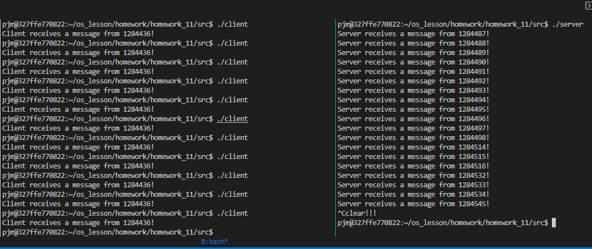

## E3_1

### 流程图


### server.c
```cpp
// author: 潘江明
// time: 2022/5/10
// server.c

// TO DO:
// server端首先捕捉软中断信号(除不能捕捉的SIGKILL)，
// 若捕捉到时则调用函数cleanup()删除消息队列，
// 终止server端。否则重复下列操作：接收所有类型为1的消息，
// 并在屏幕上显示：“Server receives a message from xxxx！”，
// 其中“xxxx”为client端的进程标识；
// 然后server端将client端的进程标识作为返回消息的类型，
// 而将自己的进程标识作为消息正文发送给client端。

#include <sys/types.h>
#include <sys/ipc.h>
#include <sys/msg.h>
#include <stdio.h>
#include <stdlib.h>
#include <signal.h>
#include <unistd.h>

#define MSGKEY 75

// msgget()  用来创建和访问一个消息队列
// msgsend() 把消息添加到消息队列中
// msgrcv()  用来从一个消息队列获取消息
// msgctl()  控制消息队列

int msgid = -1;
struct msg_st
{
    long type;      // 消息类型
    char text[256]; // 消息正文
};

void cleanup()
{
    printf("clear!!!\n");
    msgctl(msgid, IPC_RMID, NULL); // 清除消息队列
    exit(0);
}

void main()
{
    struct msg_st data;
    int pid, *p;

    // for (int i = 0; i < 20; i++)
    //     signal(i, cleanup);
    signal(SIGINT, cleanup); // 监听软中断

    // 创建消息队列
    msgid = msgget(MSGKEY, 0666 | IPC_CREAT);
    if (msgid == -1)
    {
        printf("msgget error\n"); // 创建失败
        exit(0);
    }

    while (1)
    {
        // 重复从client端接收消息
        if (msgrcv(msgid, (void *)&data, 256, 1, 0) == -1)
        {
            printf("msgrcv error\n");
        }

        p = (int *)data.text; // p指针指向data.text
        pid = *p;             // 等价于 pid = data.text

        // 输出信息
        printf("Server receives a message from %d!\n", pid);

        data.type = pid; // 消息类型为client端的pid
        *p = getpid();   // 消息正文为server端的pid

        // 发送信息至client端
        if (msgsnd(msgid, (void *)&data, sizeof(int), 0) == -1)
        {
            printf("msgsnd error\n");
            exit(EXIT_FAILURE);
        }
    }

    exit(0);
}
```

### client.c
```cpp
// author: 潘江明
// time: 2022/5/10
// client.c

// TO DO：
// client端向server端进程发送一个消息正文
// 为自己的进程标识pid且类型为1的消息，
// 然后接收来自服务器进程的消息，并在屏幕上显示：
// “Client receives a message from xxxx！”，
// 其中“xxxx”为服务器进程的进程标识。
// 最后接收server端发来的消息，
// 返回消息的类型是client端的进程标识，
// server端进程标识作为消息正文发送给client端

#include <sys/types.h>
#include <sys/ipc.h>
#include <sys/msg.h>
#include <stdio.h>
#include <stdlib.h>
#include <unistd.h>

#define MSGKEY 75

// msgget()  用来创建和访问一个消息队列
// msgsend() 把消息添加到消息队列中
// msgrcv()  用来从一个消息队列获取消息
// msgctl()  控制消息队列

struct msg_st
{
    long type;      // 消息类型
    char text[256]; // 消息正文
};

void main()
{
    struct msg_st data;
    int msgid = -1, pid, *p;

    // 创建消息队列
    msgid = msgget(MSGKEY, 0666 | IPC_CREAT);
    if (msgid == -1)
    {
        printf("msgget error\n"); // 创建失败
        exit(0);
    }

    pid = getpid();       // 获得当前进程的pid
    p = (int *)data.text; // p指针指向data.text
    *p = pid;             // 等价于 data.text = pid;
    data.type = 1;        // 消息类型定义为 1

    // 向server端发送信息
    if (msgsnd(msgid, (void *)&data, sizeof(int), 0) == -1)
    {
        printf("msgsnd error\n");
        exit(0);
    }

    // 接收server发来的信息
    if (msgrcv(msgid, (void *)&data, 256, pid, 0) == -1)
        printf("msgrcv error\n");

    // 接收到信息后，data的值更改，因此 *p = data.text
    printf("Client receives a message from %d!\n", *p);
}
```

---

### 编译
#### client.c
```
gcc client.c -o client
```
#### server.c
```
gcc server.c -o server
```

---

### 执行
#### client.c
```
./client
```
#### server.c
```
./server
```

---

### 执行结果


### 结果分析
- 服务端实现监听软中断，建立消息队列，循环接收消息类型为1的消息。每次接收创建一个类型为客户端的pid，正文为当前服务端的进程pid，向客户端发送消息。当软中断发生时，删除消息队列并退出程序。
- 客户端创建一个和服务端相同的消息队列，向服务端发送类型为1，正文为当前进程的pid的信息。然后接收来自服务端的消息，其中类型为当前客户端的pid，正文为服务端的pid。
