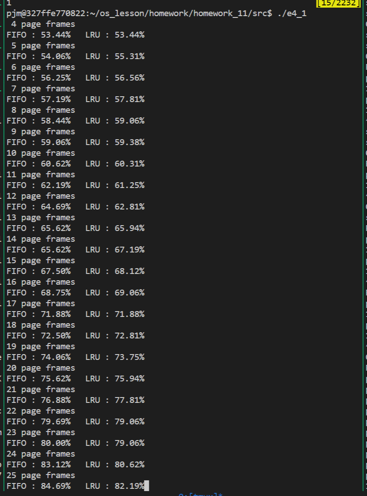

## e4_1 存储管理
### 流程图


### `e4_1.c`
```cpp
// author: 潘江明
// time: 2022/5/16
// e4_1.c

#include <stdio.h>
#include <stdlib.h>
#include <time.h>
#include <string.h>
#include <stdbool.h>

#define total_instruction 320 // 指令数
#define total_vp 32           // 虚拟页数量

// 页面结构
struct pl_type
{
    int pn;   // 进程页号
    int time; // 访问时间
} pl[total_vp + 5];

int miss, a[total_instruction], page[total_instruction], offset[total_instruction];
bool st[total_vp + 5];

// miss     缺页次数
// a[]      指令集
// page[]   指令所在页号
// offset[] 每页装入10条指令后取模运算页号偏移值
// st[]     快速判断是否放入页面内

void init(int page_num)
{
    miss = 0;
    memset(st, false, sizeof st);
    for (int i = 0; i < total_vp; i++)
        pl[i].pn = -1, pl[i].time = 0;
}

void fifo(int page_num)
{
    init(page_num);
    int point = 0;
    for (int i = 0; i < total_instruction; i++)
    {
        if (!st[page[i]])
        {
            miss++;
            st[page[i]] = true;
            if (pl[point].pn == -1)
            {
                pl[point].pn = page[i];
                point++;
            }
            else
            {
                int tmp = pl[point].pn;
                pl[point].pn = page[i];
                point++;
                st[tmp] = false;
            }
        }

        if (point == page_num)
            point = 0;
    }
    // printf("miss = %d\n", miss);
    printf("FIFO : %.2f%%\n", (1 - (double)miss / total_instruction) * 100);
}

void lru(int page_num)
{
    init(page_num);
    int point = 0;
    for (int i = 0; i < total_instruction; i++)
    {
        if (!st[page[i]])
        {
            miss++;
            st[page[i]] = true;
            for (int j = 0; j < page_num; j++)
                if (pl[point].time < pl[j].time)
                    point = j;

            if (pl[point].pn == -1)
            {
                pl[point].pn = page[i];
            }
            else
            {
                int tmp = pl[point].pn;
                pl[point].pn = page[i];
                st[tmp] = false;
            }
        }

        for (int j = 0; j < page_num; j++)
            if (pl[j].pn == page[i])
                pl[j].time = 0;
            else
                pl[j].time++;
    }
    printf("LRU : %.2f%%\n", (1 - (double)miss / total_instruction) * 100);
}

void main()
{
    srand((unsigned)time(NULL));

    int s = rand() % 319;
    for (int i = 0; i < total_instruction; i += 4)
    {
        while (s >= 319)
            s = rand() % 319;
        a[i] = s;
        a[i + 1] = a[i] + 1;
        do
        {
            s = rand() % (s + 1);
        } while (s >= 319);
        a[i + 2] = s;
        a[i + 3] = a[i + 2] + 1;
        s = rand() % (total_instruction - a[i + 3]) + a[i + 3];

        for (int j = i; j < i + 4; j++)
            if (a[j] > 319)
                printf("a[%d] = %d\n", j, a[j]);
    }

    for (int i = 0; i < total_instruction; i++)
    {
        page[i] = a[i] / 10;
        offset[i] = a[i] % 10;
    }

    for (int i = 4; i <= total_vp; i++)
    {
        printf("%2d page frames\n", i);
        fifo(i);
        lru(i);
    }
}
```

### 编译
```
gcc e4_1.c -o e4_1
```

### 执行
```
./e4_1
```

### 执行结果


### 结果分析
通过随机数生成320条指令，然后转化为页地址流，分别执行FIFO，LRU算法，计算命中率，结果如上图所示。