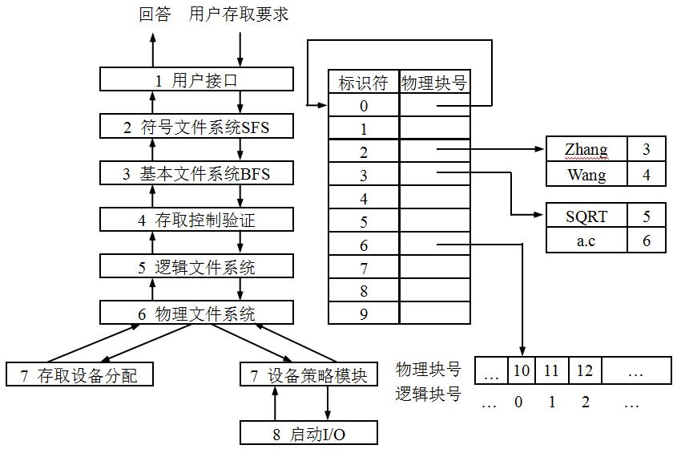

1. 主要工作：把用户提供的文件名 `Zhang/a.c` 转换为系统内部的唯一标识符`fd`，`fd=6`。
    
    结果：CALL BFS(READ, 6, 9, 20000)。

2. 从BFD中找到文件标识符为6的说明信息。

3. 根据文件的逻辑结构，找到所要进行操作的数据或记录的相对块号。

    `LBA = 记录号 * 记录长度 = 9 * 500 = 4500`

    `相对块号RBN = LBA / 物理块长PBL = 4500 / 2000 = 2`

    `块内相对地址PBO = LBA % 物理块长PBL = 4500 mod 2000 = 500`

4. 把相对块号根据文件的物理结构转换成物理地址

    物理块号为12，块内地址为500