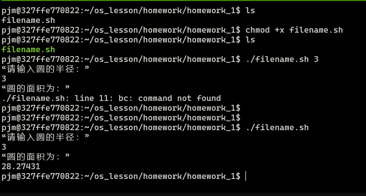

1. `echo $SHELL`

---

2. 
```sh
#!/bin/bash

PI=3.14159

echo “请输入圆的半径：”

read r

echo “圆的面积为：”

echo $PI*$r*$r | bc
```



---

3. 
```sh
#!/bin/bash

result=0

num=1

while test $num -le $1
do
    result=`expr $result + $num`
    num=`expr $num + 1`
done

echo "result=$result"
```


---

4. 
```sh
#!/bin/bash

if test -d $1   # 目录
then
    echo "directoty"
else
    echo "not directory"
fi

if test -f $1   # 文件
then
    echo "file"
else
    echo "not file"
fi

if test -x $1   # 执行
then
    echo "excuteble"
else
    echo "Archive only"
fi

if test -r $1   # 读
then
    echo "readable"
else
    echo "unreadable"
fi

if test -w $1   # 写
then
    echo "writable"
else
    echo "not writable"
fi

if test -s $1   # 是否为空
then
    echo "not empty"
else
    echo "empty"
fi
```

