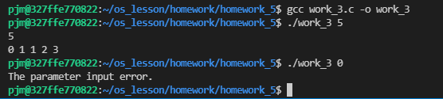

#### Code:

```cpp
// author: 潘江明
// time: 2022/3/25
// 子进程运行Fibonacci，通过管道把结果传递给父进程

#include <stdio.h>
#include <sys/types.h>
#include <sys/wait.h>
#include <unistd.h>
#include <stdlib.h>

const int N = 25;

void main(int argc, char **argv)
{
    int a[N], p, fd[2], r;

    pipe(fd);
    int n = atoi(argv[1]);
    if ((p = fork()) == 0) // son
    {
        if (n > 0)
        {
            a[0] = 0, a[1] = 1;
            for (int i = 2; i < n; i++)
            {
                a[i] = a[i - 1] + a[i - 2];
            }
            write(fd[1], a, N * sizeof(int));
        }

        exit(0);
    }
    else
    {
        wait(0);
        if (n <= 0)
        {
            printf("The parameter input error.\n");
        }
        else if (r = read(fd[0], a, N * sizeof(int)) == -1)
        {
            printf("can't read pipe\n");
        }
        else
        {
            printf("%d\n", n);
            for (int i = 0; i < n; i++)
            {
                printf("%d ", a[i]);
            }
            puts("");
        }

        exit(0);
    }
}
```

#### 编译运行：
