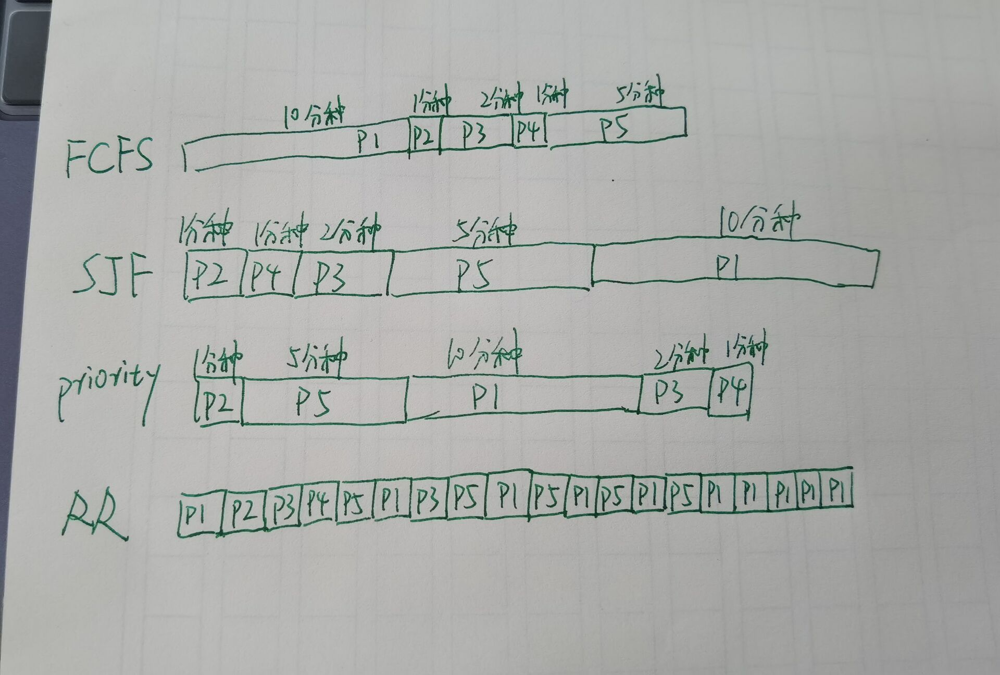

2. 

- FCFS: 
    - P1: 10 min
    - P2: 11 min
    - P3: 13 min
    - P4: 14 min
    - P5: 19 min

- SJF:
    - P2: 1 min
    - P4: 2 min
    - P3: 4 min
    - P5: 9 min
    - P1: 19 min

- Priority:
    - P2: 1 min
    - P5: 6 min
    - P1: 16 min
    - P3: 18 min
    - P4: 19 min

- RR:
    - P1: 19 min
    - P2: 2 min
    - P3: 7 min
    - P4: 4 min
    - P5: 14 min

3. 

- FCFS: 
    - P1: 0 min
    - P2: 10 min
    - P3: 11 min
    - P4: 13 min
    - P5: 14 min

- SJF:
    - P2: 0 min
    - P4: 1 min
    - P3: 2 min
    - P5: 4 min
    - P1: 9 min

- Priority:
    - P2: 0 min
    - P5: 1 min
    - P1: 6 min
    - P3: 16 min
    - P4: 18 min

- RR:
    - P1: 9 min
    - P2: 1 min
    - P3: 5 min
    - P4: 3 min
    - P5: 9 min

4. 

- FCFS: 9.6 min
- SJF: 3.2 min
- Priority: 8.2 min
- RR: 5.4 min

SJF的等待时间最短。